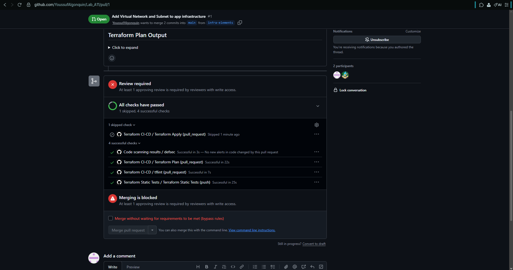
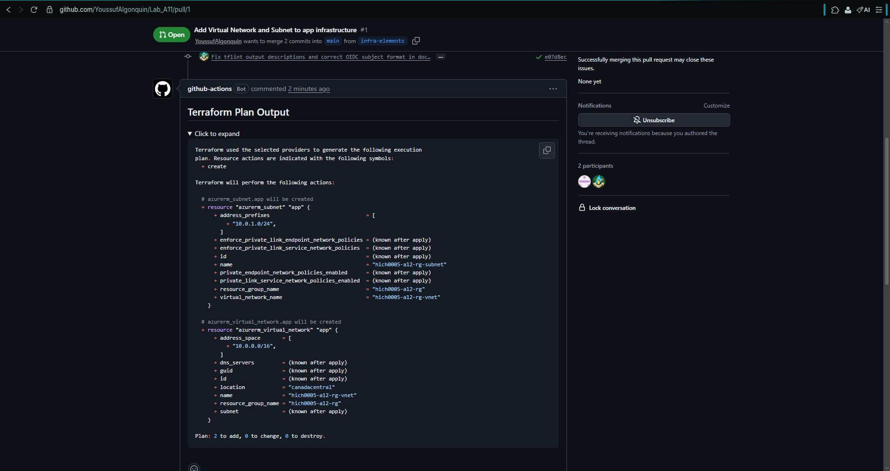

# CST8918 - Lab 12: Terraform CI/CD on Azure with GitHub Actions

## Team Members

- Youssuf ([@YoussufAlgonquin](https://github.com/YoussufAlgonquin))
- _TODO: teammate full name and [@github-username](https://github.com/github-username)_

## Background

This project implements CI/CD pipelines for a Terraform-managed Azure infrastructure using GitHub Actions. The scenario is a containerized web application (represented by the empty `app` folder) deployed to Azure Kubernetes Service (AKS). Infrastructure is defined as code in the `infra` folder.

Four automated GitHub Actions workflows are implemented:

1. **Static Code Analysis** (`infra-static-tests.yml`) - Terraform format/validate + tfsec scan on every push.
2. **Integration Tests & Deploy** (`infra-ci-cd.yml`) - `tflint`, `terraform plan` (posted to PRs) on pull requests, and `terraform apply` on merge to `main`.
3. **Drift Detection** (`infra-drift-detection.yml`) - Daily scheduled check comparing deployed infrastructure to the Terraform configuration; opens/closes a GitHub issue automatically.

## Project Structure

```plaintext
.
├── .github/workflows
│   ├── infra-ci-cd.yml
│   ├── infra-drift-detection.yml
│   └── infra-static-tests.yml
├── app/
├── infra
│   ├── az-federated-credential-params
│   │   ├── branch-main.json
│   │   ├── production-deploy.json
│   │   └── pull-request.json
│   ├── tf-app
│   │   ├── .tflint.hcl
│   │   ├── main.tf
│   │   ├── network.tf
│   │   ├── outputs.tf
│   │   ├── terraform.tf
│   │   └── variables.tf
│   └── tf-backend
│       └── main.tf
├── screenshots
├── docs
└── README.md
```

## Setup Status

- [x] `infra/tf-backend` deployed - Azure Storage Account for remote Terraform state.
- [x] `infra/tf-app` base configuration (resource group) deployed locally.
- [x] GitHub Actions workflow files authored.
- [x] Azure identities and federated credentials created (see note below).
- [ ] GitHub repository created / branch protection / environment configured.
- [ ] Repository + environment secrets populated (values below).
- [ ] `infra-elements` branch / pull request to exercise the full CI/CD pipeline.

> [!NOTE]
> The Algonquin student Azure tenant does not grant students permission to register Azure AD
> applications (`az ad app create` fails with "Insufficient privileges to complete the operation").
> We substituted **User-Assigned Managed Identities** with federated credentials, which achieve the
> same OIDC authentication for GitHub Actions but only require Azure RBAC (which we have), not a
> directory role. See [`docs/3b-managed-identities.md`](docs/3b-managed-identities.md) for the full
> explanation and commands.

### GitHub secrets to configure

**Repository level:**

| Secret | Value |
|---|---|
| `AZURE_TENANT_ID` | `ec1bd924-0a6a-4aa9-aa89-c980316c0449` |
| `AZURE_SUBSCRIPTION_ID` | `98fe3316-7082-4299-bd73-cc87fb355015` |
| `AZURE_CLIENT_ID` | `79a2c9e4-10a4-4ceb-b40a-cd6f3c481c16` (reader identity `hich0005-githubactions-r`) |
| `ARM_ACCESS_KEY` | primary access key of storage account `hich0005githubactions` (get with `az storage account keys list --account-name hich0005githubactions --resource-group hich0005-githubactions-rg --query "[0].value" -o tsv`) |

**`production` environment level:**

| Secret | Value |
|---|---|
| `AZURE_CLIENT_ID` | `449afb06-fd87-4278-8d90-da73a0667048` (contributor identity `hich0005-githubactions-rw`) |

## Screenshots

_TODO: embed the PR checks screenshot and the expanded Terraform Plan screenshot here once the pipeline has run end-to-end._




## Contributions

- **Youssuf ([@YoussufAlgonquin](https://github.com/YoussufAlgonquin))** - repo scaffolding
  (`.editorconfig`, `.gitignore`, initial `README.md`), the Terraform remote-state backend
  (`infra/tf-backend`), the Azure managed identities / federated credentials used for OIDC
  authentication, and docs steps 1-5 (`docs/1-github-settings.md` through
  `docs/5-use-oidc.md`, including `docs/3b-managed-identities.md`).
- **_TODO: teammate full name_ ([@github-username](https://github.com/github-username))** -
  application Terraform configuration (`infra/tf-app`), all three GitHub Actions workflows
  (`.github/workflows`), and docs steps 6-7 (`docs/6_0-github-actions.md` through
  `docs/7-add-infra-elements.md`).
